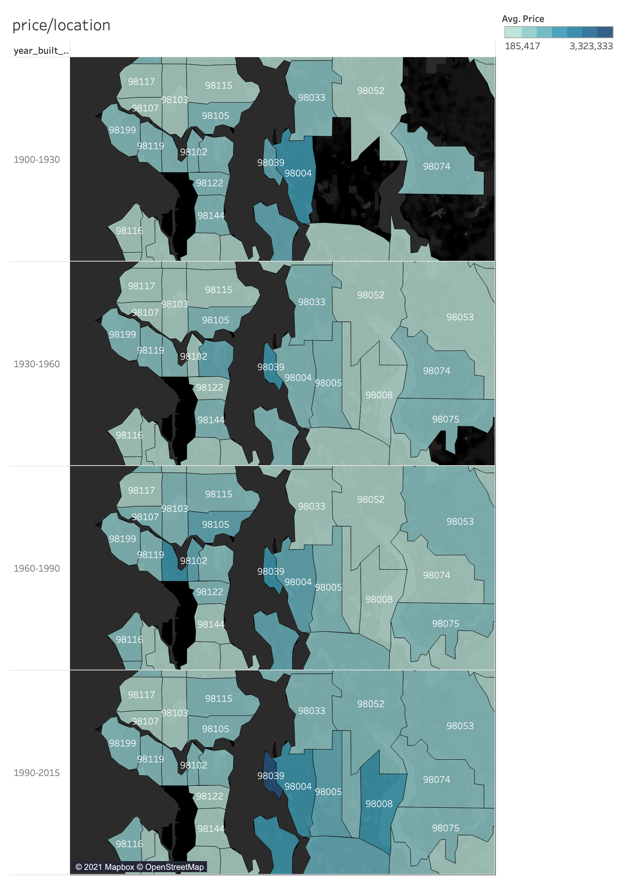

# Predicting the Selling Prices of Houses

## Note
I could not manage my time to spend enough time on the project. The overall 

## 1. Objective

There are two objectives as following.
1. Explore the characteristics of the houses 

     In order to understand One of those parameters include understanding which factors are responsible for higher property value - $650K and above. The questions have been provided later in the document for which you can use tableau.

2. Build a regression model that predicts the housing price

    The first goal of this project is to build a model that will predict the price of a house based on features provided in the dataset.

## 2. Data

The data set consists of information on some 22,000 properties.  The dataset consisted of historic data of houses sold between May 2014 to May 2015. These are the definitions of data points provided: (Note: For some of the variables that are self explanatory, no definition has been provided)

- Id: Unique identification number for the property.
- date: date the house was sold.
- price: price of the house.
- waterfront: house which has a view to a waterfront.
- condition: How good the condition is (overall). 1 - indicates worn out property and 5 excellent.
- grade: Overall grade given to the housing unit, based on King County grading system. 1 poor ,13 excellent.
- Sqft_above: square footage of house apart from basement.
- Sqft_living15: Living room area in 2015 (implies - some renovations). This might or might not have affected the lot size area.
- Sqft_lot15: Lot size area in 2015 (implies - some renovations).

## 3. Steps
### 3-1. Explore the data by SQL

Responding the questions which are presented in the instruction.

### 3-2. Explore the data and visualizing them by Tableau

THe graphs of price vs. feautures.

The map of price vs. location.

### 3-3. Build a regression model by Python

To predict the price of 

## 4. Results

### * Understanding data

I'd like to point out two characteristics of the data which I found out from the exploration process.

1. The newer properties are not necessarily more expensive.
There are properties built in early 1900s which are as expensive as those built in 2000s.

2. The trend of most expensive district has been changing from 98004 to 98039 over a centry.

### * Prediction model

## 5. Conclusion and Future Analysis

